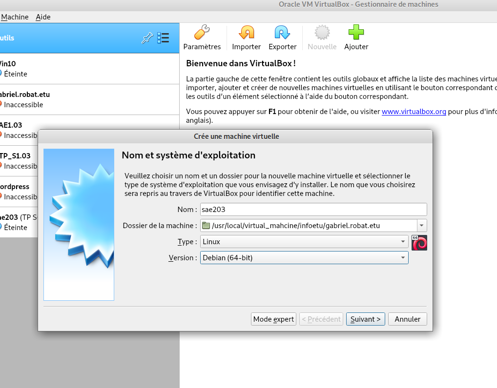
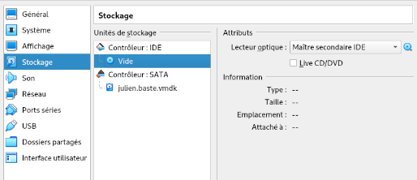
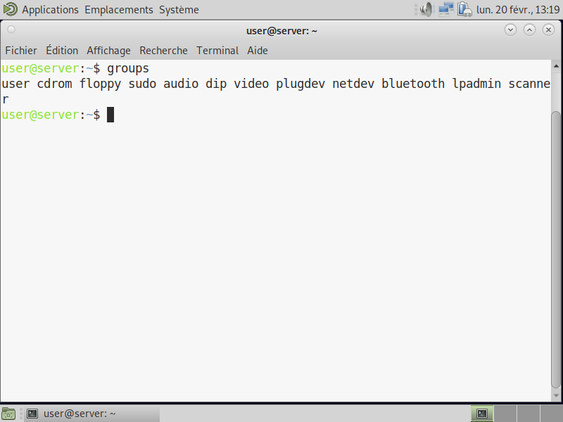

# Rapport technique : installation de services réseaux

```lang-none
Par ROBAT Gabriel, VANTARD Eddy, PLANCHON Pierre
```

----

Au cours de ce rapport, il sera à la fois question de diverses installations explicitées clairement ainsi que de points de culture à titre informatifs en rapport avec les installations.

#### Le rapport se déroulera selon le sommaire suivant :

1) [Installation d'une machine virtuelle (Debian 64-bits)](#installation-dune-machine-virtuelle-debian-64-bits)
+ [Création de la machine virtuelle](#création-de-la-machine-virtuelle)
+ [Installation du système d'exploitation](#installation-de-los)
+ [Un peu de culture générale !](#un-peu-de-culture-générale)
2) [Installation Debian automatisée par préconfiguration](#installation-debian-automatisée-par-pré-configuration)
+ [Un peu de culture à nouveau !](#un-peu-de-culture-à-nouveau)
3) [Installation de Gitea](#installation-de-gitea)
+ [Toujours plus de culture !](#toujours-plus-de-culture)

# Installation d'une machine virtuelle (Debian 64-bits) :

Tout d'abord, la machine virtuelle que nous allons créer respectera les caractéristiques suivantes :

| Nom de la machine | sae203 |
|-|-|
| *Type* | Linux |
| *Version* | Debian 11 64-bit |
| *Mémoire vive (RAM)* | 2048 Mo |
| *Disque dur* | 20 Go |

## Création de la machine virtuelle :
---

Dans un premier temps, au sein même de VirtualBox :

1) Cliquez sur *Nouvelle*  
Cette fenêtre doit apparaître  
  
2) Remplir les différents champs :  
* Nom : *sae203*  
* Dossier de machine : */usr/local/virtual_machine/infoetu/**login***  
* Remplacer **login** par **penom.nom.etu**  
* Type : *Linux*  
* Version : *Debian (64-bit)*  
3) Pour la taille de mémoire, sélectionnez 2048 MB
4) Pour le disque dur, creéz en un virtuel, de type VMDK
5) Sélectionnez le stockage dynamiquement alloué
> Cocher *diviser en plusieurs fichiers  de moins de 2 Go* peut être utile si vous comptez transporter votre VM sur un autre support physique (clé USB, disque dur externe...)
6) Ne changez pas l'emplacement du fichier et allouez une taille de 20,00 Gio

Maintenant cela fait, nous pouvons désormais passer à l'installation du système d'exploitation.

##  Installation de l'OS :
---

* Démarrez la machine
* Sélectionnez un iso (trouvable au préalable sur le site de [Debian](https://www.debian.org/index.fr.html) dans notre cas)
* Sélectionnez *install*
* Sélectionnez la langue, le pays et la région habitée, ici **France**
* Sélectionnez les disposition du clavier
	* *France* pour **AZERTY** 
	* *Britannique* pour **QWERTY**

> Chargement

* Donnez un nom à votre machine
* Pour le nom de domaine du réseau, laissez-le VIDE
* Sélection du miroir :
    * la pays : *France*
    * le miroir le plus proche : *debian.polytech-lille.fr*
* Le serveur mandataire : *http://cache.univ-lille.fr:3128*

> Chargement

### **Création des utilisateurs :**

1). Création du Superutilisateur
* Entrer un mot de passe
* Le confirmer

2). Création de l'utilisateur
* Nom complet
* Login
* Mot de passe que l'on confirme

### **Partionner le disque :**

* Utiliser un disque entier
* Choisir le disque voulu
* Inclure le tout dans une seule partition de disque
* Valider le choix
* Accepter de l'appliquer
* Selectionner le noyau par défaut et l'image générique
* La transmission des données selon votre gré (ici *NON*)

### **Sélection des logiciels :**

 * environnement de burean Debian
 * MATE
 * on déselectionner GNOME
 * serveur WEB
 * serveur SSH
 * utilitaire usuels du système

Ensuite n'oubliez pas d'installer GRUB, sinon la machine ne pourra pas démarrer
> sur le disque /dev/sda
 
 L'installation est maintenant terminée, il suffit d'accepter. Suite à cela, éteingnez la machine.

### **Retirer l'iso si nécessaire :**

Dans le cas où votre machine se relance sur l'iso d'installation du système d'exploitation, il est nécessaire de retirer le disque du lecteur virtuel. 
1) Sélectionner la machine
2) Sélectionner l'onglet *configuration*
3) Une fenêtre s'ouvre, sélectionner *Stockage*
4) Sous *Controleur : IDE*  
Retirer votre .iso du controleur.  
L'onglet stockage devrait désormais être identique à cette image.  



### **On peut maintenant démarrer la machine qui est configurée !**
En revanche, il nous reste bel et bien quelques configurations post-installation à effectuer.

#### **Préparation du système**

#### Accès `sudo` pour user

Une fois la machine démarrée, nous allons ajouter les droits sudo à l'utilisateur user pour qu'il puisse agir sur la machine au besoin.

- On se connecte d'abord en root grâce au login 'root' et son mot de passe 'root' également.
  
    

    Il suffit ensuite d'ouvrir un terminal (CTRL+ALT+T) et d'entrer la commande suivante :

    ```shell
    sudo adduser user sudo
    ```


L'utilisateur pourra désormais effectuer des actions importantes grâce à ces droits.
Installons aussi les suppléments invités pour le confort de l'utilisateur avant tout.

#### **Installation des suppléments invités**

Toujours dans un terminal :
- Montage du CD
  
```shell
sudo mount /dev/cdrom/mnt
```

- Installation des suppléments :

```shell
sudo /mnt/VBoxLinuxAdditions.run
```

Il ne reste plus qu'à redémarrer la machine.

## Un peu de culture générale !
---
Ces quelques informations sont en lien direct avec ce que vous venez de faire.

Lorsque l'on installe un système d'exploitation, dans notre cas un Debian, on peut remarquer une version 64-bit.

*Que signifie “64-bit” dans “Debian 64-bit” ?*

Dans ce cas, il est ici désigné le type d'architecture du système. Ce dernier doit correspondre à celui du processeur afin de bien fonctionner.

---

Après avoir installé un OS, *quelle est la configuration réseau utilisée par défaut ?*

La commande ```ip route show``` permet d'afficher la table de routage dans son entiereté (si aucun paramètre n'est spécifié), et donc la  configuration réseau par défaut de la machine. Autrement dit, elle affiche les routes empruntées pour faire transiter les informations. L'adresse IPv4 qui suit "default via" est la route empruntée par défaut.

---

La configuration de la machine est stockée dans un fichier XML.

Le nom de ce fichier est, en principe, le nom de la machine virtuelle (soit sae203 dans notre cas).

pour trouver le fichier xml a modifier :  dans le fichier sae203.vbox 
dedans se trouve les vm, on va ensuite dans le fichier de la vm correspondante 
(ici sae203) puis faire un nano du fichier de notre vm. 
Chercher 
```
<CPU count ="?">
```
et remplacer le ? par le nombre de coeurs de processeurs voulu, ici *2*.

---

Afin d'installer le système d'exploitation de la machine nous avons eu
recours à un fichier iso bootable. *Qu'est-ce qu'implique ce genre ce fichier ?*

Les fichiers iso bootables sont généralement utilisés pour fournir
les fichiers d'installation d'un système d'exploitation. Ces derniers sont
des fichiers images créés à partir d'un CD et peut ainsi se comporter comme tel.

---

Lors de l'installation, il nous a été demandé de choisir si nous voulions
installé divers éléments. Dans cette liste étaient présents différents
environnements de bureau, serveur web, serveur ssh..
*Qu'est-ce que MATE, ou GNOME par exemple ?*

[MATE](https://wiki.debian.org/fr/MATE) ou [GNOME](https://wiki.debian.org/fr/Gnome) sont deux exemples d'environnements de bureau libre. Ces derniers
définissent notamment les fonctionnalités et les visuels du bureau du système.

---

*Qu'en est-il du serveur web ?*

Par définition, un serveur web est un serveur répondant à des requêtes sur un réseau qui peut être public ou privé.

__Référence :__ [developer.mozilla.org](https://developer.mozilla.org/fr/docs/Learn/Common_questions/Web_mechanics/What_is_a_web_server)

---

*Que désignait "serveur ssh" ?*

SSH signifie Secure Socket Shell, ce dernier est un protocole réseau qui permet à un administrateur d'accéder à distance à un ordinateur.

__Référence :__ [it-connect.fr](https://www.it-connect.fr/chapitres/quest-ce-que-ssh/) 


---

*De même, qu'est-ce qu'un serveur mandataire ?*

Un serveur mandataire ou proxy est un programme servant d'intermédiaire pour accéder à un autre réseau. Par extension, on désigne aussi comme proxy un matériel comme un serveur mis en place pour assurer le fonctionnement de tels services.

__Référence :__ [debian-handbook.info](https://debian-handbook.info/browse/fr-FR/stable/sect.http-ftp-proxy.html)

---


Afin que notre compte utilisateur puisse configurer la machine, les droits sudo devaient lui être ajoutés. 
*Mais comment faire pour savoir à quels groupes appartient un utilisateur ?*

Dans un terminal, on peut taper la commande suivante :

```shell
groups <user>
```



La version du noyau Linux utilisée par votre machine peut être utile à connaitre pour configurer correctement la machine. *Comment la trouver ?*

On peut soit taper une commande dans un terminal :
```
uname -mr
```
ou bien lire le contenu d'un fichier bien précis :
``` 
cat /proc/version
```
Dans notre cas, voila ce que l'on trouve :  
5.10.0-21-amd64 x86_64  

---

Après installation, nous avons ajouté des suppléments invités à la machine virtuelle. 
*Qu'en est-il ? Pourquoi les installer ?*

Les suppléments invité sont des pilotes de périphériques et/ou d'applications système. Ceux-ci améliorent les performances du système d'exploitation invité dans un premier temps et permettent une meilleure interaction entre la machine hôte et la machine invitée. C'est avant tout un confort pour l'utilisateur de la machine virtuelle.

__Références :__ [docs.oracle.com](https://docs.oracle.com/cd/E26217_01/E35193/html/qs-guest-additions.html)

---

Afin d'installer les suppléments invités nous avons notamment utilisé la commande mount. 
*Que fait exactement cette commande ?*

La commande mount permet en fait d'attacher un système de fichiers que l'on trouve sur un périphérique quelconque à la racine (l'arborescence de fichiers). Analogiquement, cela revient à indiquer au noyau de lire les fichiers présents sur un disque.

__Références :__ [ibm.com](https://www.ibm.com/docs/fr/power8?topic=commands-mount-command)

---

##### [Retour au sommaire](#le-rapport-se-déroulera-selon-le-sommaire-suivant)

# Installation Debian automatisée par pré-configuration

Pour cette installation préconfigurée, il sera nécessaire de placer dans le lecteur optique un fichier viso et non pas iso cette fois.
Ce dernier est lié à d'autres fichiers et permet l'installation automatisée.

Un autre fichier nécessaire est généralement nommé preseed.cfg. Ce fichier de configuration permet de choisir à l'avance quels choix seront effectués durant l'installation du système Debian pour que tout s'enchaîne sans attendre.

Par exemple, pour ajouter les droits sudo directement, on peut ajouter l'utilisateur au groupe sudo dès la création :
On trouve la ligne correspondante et on ajoute sudo à la fin :

    d-i passwd/user-default-groups string audio cdrom video sudo

Pour l'installation de l'environnement MATE on procède la même manière :
On trouve la ligne correspondante et on ajoute mate-desktop à la liste.

    tasksel tasksel/first multiselect standard ssh-server mate-desktop

Pour les autres paquets que l'on voudrait installer au passage on rajoute cette ligne juste en dessous de celle précédente :

    d-i pkgsel/include string sudo git sqlite3 curl bash-completion neofetch


Passons maintenant à une autre partie culture et informations de ce rapport.

## Un peu de culture à nouveau !
---
* ### À propos de la distribution Debian :

Après avoir installé un système Debian sur notre machine virtuelle, nous pouvons nous poser quelques questions à ce sujet, par exemple :

*Qu’est-ce que le Projet Debian ? D’où vient le nom Debian ?*

Ce projet est avant tout une association d'individus qui se sont donnés comme ambition de créer un système d'exploitation libre.
Le nom Debian vient du créateur directement prénommé Ian Murdock et de sa femme, Debra. Debra et Ian donna alors assez naturellement Debian.

__Référence :__ [debian.org](https://www.debian.org/intro/about)

---

A propos de la maintenance des versions de Debian, il existe 3 durées de prise en charge (support) de ces versions : la durée minimale, la durée en support long terme (LTS) et la durée en support long terme étendue (ELTS).

*Quelle sont donc les durées de ces prises en charge ?*

La durée minimale correspond à la date de publication de la prochaine version stable à laquelle on ajoute un an.
La durée en support long terme (LTS) est elle d'au moins 5 ans, et pour une ELTS on compte encore 5 ans de plus.

__Références :__ [debian.org (durée minimale)](https://wiki.debian.org/fr/DebianReleases) ; [debian.org (LTS)](https://wiki.debian.org/fr/LTS) ; [debian.org (ELTS)](https://wiki.debian.org/fr/LTS/Extended)

---

*Et pendant combien de temps les mises à jour de sécurité seront-elles fournies ?*

Cela peut compter environ une année après que la version stable suivante a été publiée.

__Référence :__ [debian.org](https://www.debian.org/security/faq.fr.html)

---

* ### A propos des noms génériques, noms de code et versions :

*Combien de version au minimum sont activement maintenues par Debian ?*

Généralement au moins trois versions sont maintenues: une stable, une testing et une unstable.

__Référence :__ [debian.org](https://www.debian.org/releases/index.fr.html)

---

Chaque distribution majeur possède un nom de code différent. Par exemple, la version majeur actuelle (Debian 11) se nomme Bullseye.
*Mais d’où viennent les noms de code données aux distributions ?*

Les noms de code de chaque distribution proviennent toujours des personnages de la série de films *"Toy Story"*.

__Référence :__ [debian.org](https://www.debian.org/doc/manuals/debian-faq/ftparchives#sourceforcodenames)

----

L’un des atouts de Debian fut le nombre d’architecture (≈ processeurs) officiellement prises en charge par ce dernier. 
*Combien et lesquelles sont prises en charge par la version Bullseye ?*

Les architectures prises en charge par la version Bullseye sont au nombre de 9 architectures:
+ AMD64 & Intel 64
+ Intel x86-based
+ ARM
+ ARM avec matériel FPU
+ ARM 64 bits
+ MIPS 64 bits
+ MIPS 32 bits
+ Power Systems
+ IBM S/390 64 bits

__Référence :__ [debian.org](https://www.debian.org/releases/stable/i386/ch02s01.fr.html)

---

* ### A propos de la première version avec un nom de code

*Quelle a était le premier nom de code utilisé ?*

Le tout premier nom de code utilisé fut Buzz.

---

*Quand a-t-il été annoncé ?*

Ce dernier fut annoncé le 17 juin 1996.

---

*Quelle était le numéro de version de cette distribution ?*

Cette même version fut attribuée au numéro de version Debian GNU/Linux 1.1.

__Référence :__ [debian.org](https://wiki.debian.org/fr/DebianBuzz)

---

* ### A propos de la dernière version avec un nom de code attribué

*Quel est le dernier nom de code annoncée à ce jour ?*

Le nom de code le plus récemment annoncé à ce jour est Bullseye.

---

*Quand a-t-il été annoncé ?*

Ce dernier fut annoncé le 14 août 2021.

---

*Quelle est la version de cette distribution ?*

La première version de cette distribution fut la version 11.0 et sa dernière mise à jour est la version 11.6.

__Référence :__ [debian.org](https://wiki.debian.org/fr/DebianTrixie)

---

##### [Retour au sommaire](#le-rapport-se-déroulera-selon-le-sommaire-suivant)

# Installation de Gitea

Il est important dans un premier temps de vérifier que git-gui et gitk sont bien installés sur votre machine.
Configurez également votre git grâce aux commandes suivantes :
```shell
git config --global user.name "Prénom Nom"
git config --global user.email "votre@email"
git config --global init.defaultBranch "master"
```

Après cela, il est indispensable de rediriger le port qui sera utilisé par Gitea étant donné que nous utilisons une machine virtuelle.

Au sein de VirtualBox directement :
1) Accédez aux paramètres de votre machine virtuelle.
2) Dirigez vous vers l'onglet *Réseau*.
3) *Avancé*, *Redirection de ports*
4) Ajoutez une redirection
    | Nom | Protocole | IP hôte | Port hôte | IP invité | Port invité |
    |-|-|-|-|-|-|
    | gitea | TCP | *Vide* | 3000 | *Vide* | 3000 |

Désormais dans un terminal de votre machine virtuelle :

Cette commande permettra de télécharger le fichier voulu directement :
```shell
wget -O gitea https://dl.gitea.com/gitea/1.18.5/gitea-1.18.5-linux-amd64
chmod +x gitea
```

Cette série de commande crée un utilisateur particulier qui ne servira qu'à démarrer votre serveur :
```shell
adduser \
   --system \
   --shell /bin/bash \
   --gecos 'Git Version Control' \
   --group \
   --disabled-password \
   --home /home/git \
   git
```

Cette série ci sert à créer toute la structure de fichiers nécessaire à l'installation :
```shell
mkdir -p /var/lib/gitea/{custom,data,log}
chown -R git:git /var/lib/gitea/
chmod -R 750 /var/lib/gitea/
mkdir /etc/gitea
chown root:git /etc/gitea
chmod 770 /etc/gitea
```

Enfin, pour configurer ces fichiers :
```shell
export GITEA_WORK_DIR=/var/lib/gitea/
cp gitea /usr/local/bin/gitea
```

L'installation est concrètement terminée.
Nous allons pour finir mettre en place le démarrage automatique de gitea sur la machine.

Copiez l'exemple présent au lien suivant : [github](https://github.com/go-gitea/gitea/blob/main/contrib/systemd/gitea.service).
Puis coller le dans le fichier /etc/systemd/system/gitea.service
Vous pouvez décommenter tout service que vous voulez rendre actif.

Lancez alors Gitea pour la toute dernière fois après quoi il se lancera seul au démarrage :
```shell
sudo systemctl enable gitea
sudo systemctl start gitea
```

Il ne vous reste qu'à accéder à l'adresse http://localhost:3000/ sur votre machine physique et à configurer votre Gitea comme bon vous semble !

Ce rapport touche bientôt à sa fin mais voici un peu d'informations pour finir.

## Toujours plus de culture !
---

*Qu’est-ce que le logiciel git-gui ?*
git-gui est une interface graphique qui s'intégre à la commande git via la commande :
```shell
git gui [<command>] [<arguments>]
```
__Référence :__ [git-scm](https://git-scm.com/docs/git-gui)

---

*Qu’est-ce que le logiciel gitk ?*
gitk est une interface graphique s'intégrant également à git. Cette dernière permet de visualiser l'historique des commits sous forme de graphe. Dans le répertoire du projet on tape la commande :
```shell
gitk &
``` 
__Référence :__ [git-scm](https://git-scm.com/docs/gitk)

---

*Quelle sera la ligne de commande git pour utiliser par défaut le proxy de l’université sur tous vos projets git ?*
```shell
git config --global http://cache.univ-lille.fr:3128
```
__Référence :__ [git-scm](https://git-scm.com/docs/git-config#Documentation/git-config.txt-httpproxy)

---

* ### A propos de Gitea

*Qu'est-ce que Gitea ?*

Gitea est un client web de git permettant d'héberger sa propre instance de git sur son propre serveur.

__Référence :__ [git-scm](https://docs.gitea.io/fr-fr/)

---

*A quels logiciels bien connus dans ce domaine peut-on le comparer ?*

On peut comparer assez directement Gitea avec GitHub ou GitLab par exemple.

__Référence :__ [git-scm](https://docs.gitea.io/fr-fr/)

---

```lang-none
Par ROBAT Gabriel, VANTARD Eddy, PLANCHON Pierre
```